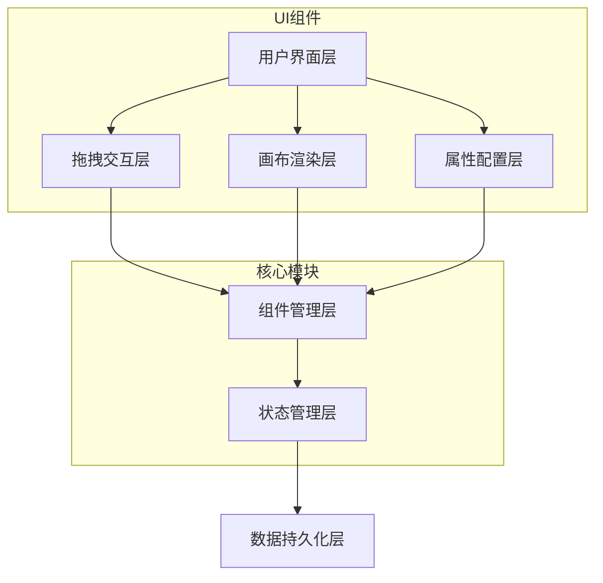

# 表单设计器设计文档

## 概述

表单设计器是一个基于 Web 的可视化表单构建工具，采用现代前端技术栈实现。系统采用组件化架构，支持拖拽式操作，提供实时预览和属性配置功能。整体架构分为画布渲染层、拖拽交互层、组件管理层和数据持久化层。

## 架构

### 系统架构图



### 技术栈选择

- **前端框架**: React 18+（支持并发特性和更好的性能）
- **拖拽库**: @dnd-kit/core（现代化的拖拽解决方案）
- **状态管理**: Zustand（轻量级状态管理）
- **样式方案**: Tailwind CSS + CSS Modules
- **UI组件库**: Shadcn/ui（提供丰富的表单组件）
- **类型检查**: TypeScript

## 组件和接口

### 核心组件结构

```typescript
// 表单设计器主组件
interface FormDesigner {
  canvas: CanvasArea;           // 画布区域
  componentPanel: ComponentPanel; // 组件面板
  propertyPanel: PropertyPanel;   // 属性面板
  toolbar: Toolbar;              // 工具栏
}

// 画布区域组件
interface CanvasArea {
  formSchema: FormSchema;        // 表单结构数据
  selectedComponent: string;     // 选中的组件ID
  dragOverlay: DragOverlay;      // 拖拽覆盖层
  componentRenderer: ComponentRenderer; // 组件渲染器
}

// 组件面板
interface ComponentPanel {
  layoutComponents: LayoutComponent[]; // 布局组件列表
  formControls: FormControl[];        // 表单控件列表
  draggableItems: DraggableItem[];    // 可拖拽项目
}

// 属性面板
interface PropertyPanel {
  isOpen: boolean;               // 面板开启状态
  selectedComponent: ComponentConfig; // 选中组件配置
  propertyForm: PropertyForm;    // 属性配置表单
}
```

### 数据模型

```typescript
// 表单结构模型
interface FormSchema {
  id: string;
  name: string;
  components: ComponentNode[];
  layout: LayoutConfig;
}

// 组件节点模型
interface ComponentNode {
  id: string;
  type: ComponentType;
  props: ComponentProps;
  children?: ComponentNode[];
  parent?: string;
  position: Position;
  style: CSSProperties;
}

// 组件类型枚举
enum ComponentType {
  // 布局组件
  CONTAINER = 'container',
  ROW = 'row',
  COLUMN = 'column',
  GRID = 'grid',
  
  // 表单控件
  INPUT = 'input',
  SELECT = 'select',
  TEXTAREA = 'textarea',
  CHECKBOX = 'checkbox',
  RADIO = 'radio',
  BUTTON = 'button',
  
  // 展示组件
  IMAGE = 'image',
  TEXT = 'text',
  DIVIDER = 'divider'
}

// 组件属性模型
interface ComponentProps {
  label?: string;
  placeholder?: string;
  required?: boolean;
  disabled?: boolean;
  defaultValue?: any;
  validation?: ValidationRule[];
  // 图片组件特有属性
  src?: string;
  alt?: string;
  // 样式属性
  className?: string;
  style?: CSSProperties;
}
```

### 拖拽系统接口

```typescript
// 拖拽数据传输对象
interface DragData {
  type: 'component' | 'reorder';
  componentType?: ComponentType;
  componentId?: string;
  sourceIndex?: number;
}

// 放置目标接口
interface DropTarget {
  id: string;
  type: 'canvas' | 'container';
  acceptTypes: ComponentType[];
  position: DropPosition;
}

// 拖拽状态管理
interface DragState {
  isDragging: boolean;
  draggedItem: DragData | null;
  dropTarget: DropTarget | null;
  previewComponent: ComponentNode | null;
}
```

## 数据模型

### 状态管理架构

使用 Zustand 进行状态管理，采用分片式状态设计：

```typescript
// 主状态存储
interface FormDesignerStore {
  // 表单数据
  formSchema: FormSchema;
  
  // UI状态
  selectedComponentId: string | null;
  propertyPanelOpen: boolean;
  
  // 拖拽状态
  dragState: DragState;
  
  // 操作方法
  actions: {
    // 组件操作
    addComponent: (component: ComponentNode, targetId?: string) => void;
    removeComponent: (componentId: string) => void;
    updateComponent: (componentId: string, updates: Partial<ComponentNode>) => void;
    moveComponent: (componentId: string, targetId: string, position: number) => void;
    
    // 选择操作
    selectComponent: (componentId: string | null) => void;
    
    // 属性面板操作
    openPropertyPanel: () => void;
    closePropertyPanel: () => void;
    
    // 拖拽操作
    startDrag: (dragData: DragData) => void;
    endDrag: () => void;
    setDropTarget: (target: DropTarget | null) => void;
  };
}
```

### 数据持久化

```typescript
// 表单数据序列化
interface FormDataSerializer {
  serialize: (formSchema: FormSchema) => string;
  deserialize: (data: string) => FormSchema;
  validate: (data: any) => boolean;
}

// 本地存储管理
interface StorageManager {
  save: (key: string, formSchema: FormSchema) => Promise<void>;
  load: (key: string) => Promise<FormSchema | null>;
  list: () => Promise<string[]>;
  delete: (key: string) => Promise<void>;
}
```

## 错误处理

### 错误类型定义

```typescript
enum ErrorType {
  DRAG_DROP_ERROR = 'DRAG_DROP_ERROR',
  COMPONENT_RENDER_ERROR = 'COMPONENT_RENDER_ERROR',
  PROPERTY_VALIDATION_ERROR = 'PROPERTY_VALIDATION_ERROR',
  STORAGE_ERROR = 'STORAGE_ERROR'
}

interface FormDesignerError {
  type: ErrorType;
  message: string;
  componentId?: string;
  details?: any;
}
```

### 错误处理策略

1. **拖拽错误处理**
   - 无效放置目标时显示错误提示
   - 拖拽中断时恢复原始状态
   - 循环嵌套检测和阻止

2. **组件渲染错误处理**
   - 使用 Error Boundary 捕获渲染错误
   - 显示错误占位符而不是崩溃
   - 提供错误恢复机制

3. **属性验证错误处理**
   - 实时属性验证和错误提示
   - 无效属性值时使用默认值
   - 属性冲突检测和解决

4. **存储错误处理**
   - 自动保存失败时的重试机制
   - 数据损坏时的恢复策略
   - 版本兼容性检查

## 测试策略

### 单元测试

1. **组件测试**
   - 每个 UI 组件的渲染测试
   - 组件属性变化的响应测试
   - 事件处理函数的测试

2. **状态管理测试**
   - Store actions 的功能测试
   - 状态变化的正确性测试
   - 异步操作的测试

3. **工具函数测试**
   - 数据序列化/反序列化测试
   - 验证函数的测试
   - 工具方法的边界条件测试

### 集成测试

1. **拖拽流程测试**
   - 从组件面板拖拽到画布的完整流程
   - 画布内组件重排序的测试
   - 嵌套组件的拖拽测试

2. **属性配置测试**
   - 属性面板的打开/关闭测试
   - 属性修改的实时更新测试
   - 不同组件类型的属性配置测试
